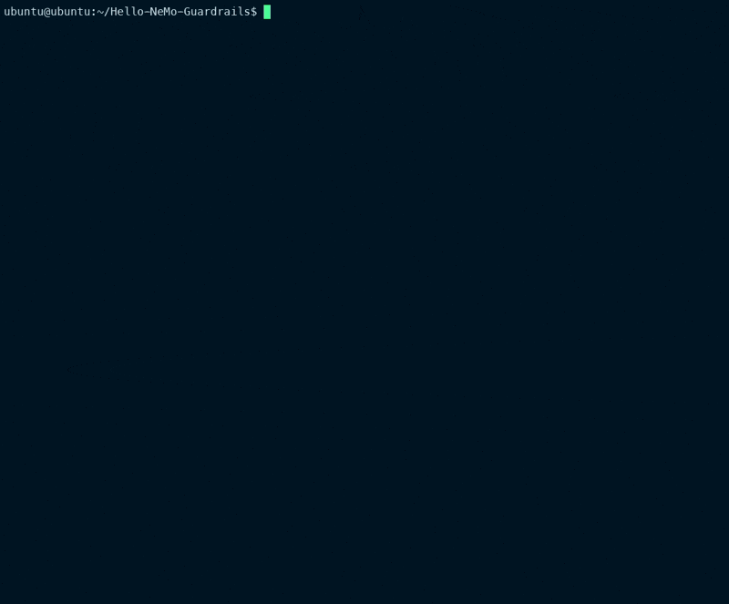

# Local LLM Guardrails Lab

A hands-on experimentation project for building, testing, and refining
conversational guardrails with [NVIDIA NeMo Guardrails](https://github.com/NVIDIA/NeMo-Guardrails), [Ollama](https://ollama.com/), and the local `llama3.2` model.

The project is intentionally small and self-contained. It provides repeatable
experiments for common guardrail patterns without requiring a cloud API key:

- topical boundaries for a task-focused assistant;
- basic jailbreak detection and refusal flows;
- fact-constrained answers from a small knowledge base; and
- controlled execution of custom actions.



> **Experiment, not a production safety system.** These examples demonstrate
> rule-based guardrail techniques. Evaluate and harden them against the risks,
> policies, models, and prompt patterns relevant to a real deployment.

## Stack

| Component | Purpose |
| --- | --- |
| Python 3.9–3.12 | Runtime for the examples |
| NeMo Guardrails | Conversation orchestration and Colang rails |
| Ollama | Local model server |
| `llama3.2` | Default local LLM |

Every experiment uses Ollama's default OpenAI-compatible endpoint:
`http://localhost:11434/v1`.

## Experiments

| Script | What it explores | Configuration |
| --- | --- | --- |
| `topical.py` | Routes politics and financial-advice requests to fixed refusals while allowing recipe questions. | `config_topical/` |
| `jailbreak.py` | Tests defined jailbreak patterns alongside a normal request. | `config_jailbreak/` |
| `fact_checking.py` | Constrains responses to the facts in the configuration. | `config_fact_checking/` |
| `actions.py` | Invokes custom Python actions for the current time, date, and demonstration weather. | `config_actions/` |

## Quick start

### 1. Prepare Ollama

Install Ollama, then download the model:

```bash
ollama pull llama3.2
```

Ensure the local server is running. The desktop application normally starts it
automatically; otherwise run:

```bash
ollama serve
```

Confirm that Ollama can see the model:

```bash
ollama list
```

### 2. Create a Python environment

From the project root:

```bash
python3 -m venv .venv
source .venv/bin/activate
python3 -m pip install --upgrade pip
python3 -m pip install -r requirements.txt
```

### 3. Run an experiment

```bash
python3 jailbreak.py
```

Run the other experiments independently:

```bash
python3 topical.py
python3 fact_checking.py
python3 actions.py
```

No `OPENAI_API_KEY` or NVIDIA NIM credentials are required.

## How the project is organized

```text
.
├── actions.py                    # Custom-action experiment runner
├── fact_checking.py              # Fact-constrained response runner
├── jailbreak.py                  # Jailbreak-pattern experiment runner
├── topical.py                    # Topic-boundary experiment runner
├── config_actions/
│   ├── actions.py                # Exposes actions to the Colang flow
│   ├── config.yml                # Ollama model and assistant instructions
│   └── rails.co                  # Time, date, and weather flows
├── config_fact_checking/
│   └── config.yml                # Ollama model and bounded fact set
├── config_jailbreak/
│   ├── config.yml                # Ollama model and assistant instructions
│   └── rails.co                  # Jailbreak detection and refusal flow
└── config_topical/
    ├── config.yml                # Ollama model and recipe-assistant prompt
    └── disallowed_topics.co      # Politics and finance topic rails
```

## Model configuration

Each experiment declares the same local model in its `config.yml`:

```yaml
models:
  - type: main
    engine: ollama
    model: llama3.2
    parameters:
      base_url: http://localhost:11434/v1
```

To use a different locally installed model, update `model` in each
`config_*/config.yml` file, then download it with `ollama pull <model-name>`.
For a server on another host or port, change `base_url` to that server's
OpenAI-compatible endpoint.

## Extending an experiment

1. Update the assistant instructions in the experiment's `config.yml`.
2. Add user patterns, responses, and flows to its `.co` file.
3. Add representative prompts to the corresponding Python runner.
4. Run the script and compare the result with the expected behavior.

For custom actions, define a Python function decorated with `@action` in
`actions.py`, import it from `config_actions/actions.py`, and invoke it from the
Colang flow with `execute <action_name>`.

## Troubleshooting

| Symptom | Resolution |
| --- | --- |
| Connection refused at port `11434` | Start Ollama with `ollama serve` or open the Ollama desktop application. |
| Model not found | Run `ollama pull llama3.2`, then confirm it appears in `ollama list`. |
| Python cannot import `nemoguardrails` | Activate `.venv` and rerun `python3 -m pip install -r requirements.txt`. |
| Responses do not match a defined rail | Make the test prompt closer to a declared user pattern, or add the pattern to the relevant `.co` file. |

## References

- [NeMo Guardrails documentation](https://docs.nvidia.com/nemo/guardrails/)
- [NeMo Guardrails model configuration](https://docs.nvidia.com/nemo/guardrails/latest/configure-guardrails/yaml-schema/model-configuration)
- [Ollama documentation](https://docs.ollama.com/)
